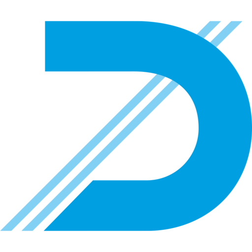

<div align="center">



# Dücker Medizintechnik

Entdecken Sie unser breites Spektrum an Produkten und Dienstleistungen für die Aufbereitung von OP-Werkzeugen. Erfahren Sie, wie wir Ihnen dabei helfen, eine optimale Versorgung im medizinischen Kontext zu gewährleisten.

[](https://github.com/dmnktoe/duecker-medizintechnik/actions/workflows/ci.yml)
[](https://codecov.io/gh/dmnktoe/duecker-medizintechnik)
[](https://wakatime.com/badge/user/79bbeb65-a4e6-42f7-a094-22622866010f/project/1251edf1-9d68-4bca-a767-7fa3c12e1f2f)

</div>

## Basic Usage

If you're looking to begin developing on the website, you can install the dependencies directly via [Yarn](https://yarnpkg.com/):

```bash
yarn
```

Or if you prefer [NPM](https://npmjs.com):

```bash
npm install --save @outlet-delivery/signal
```
